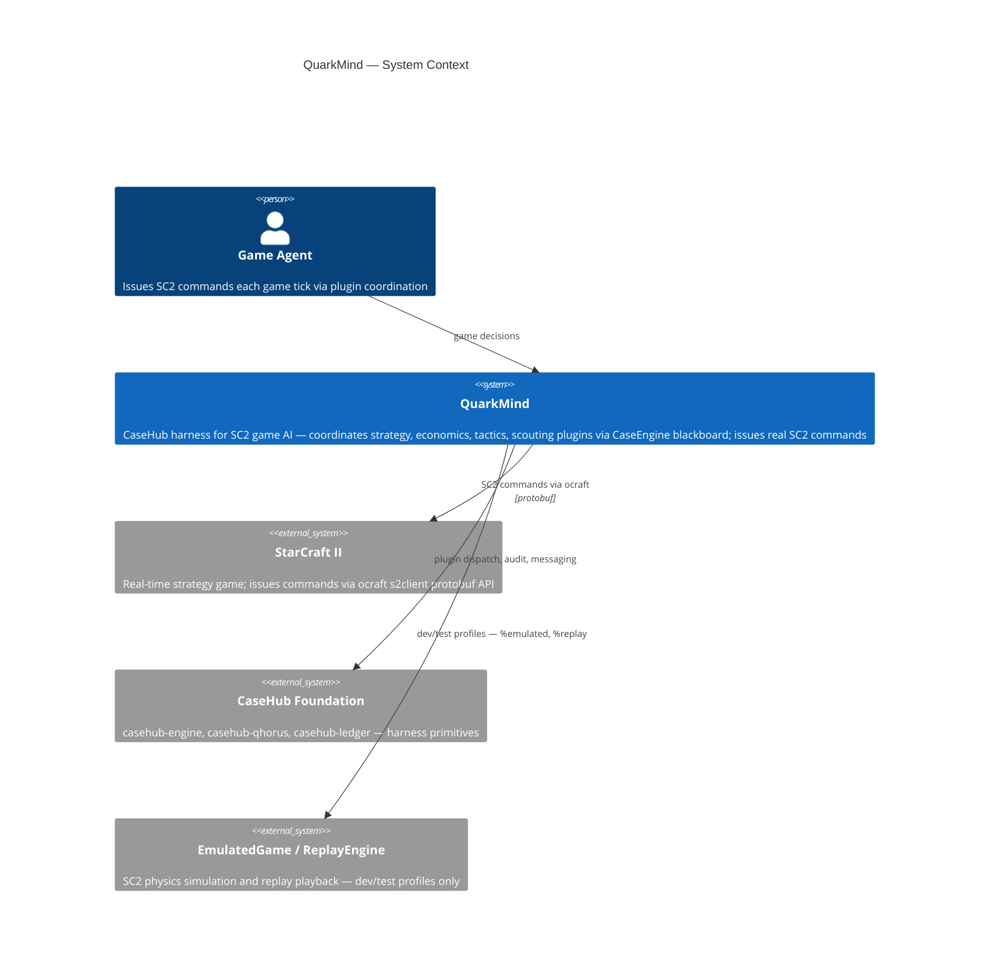
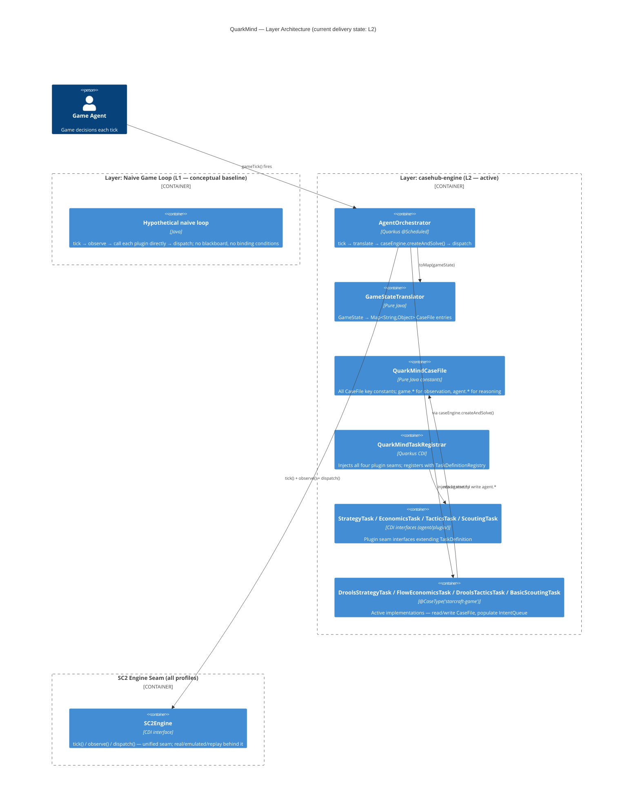
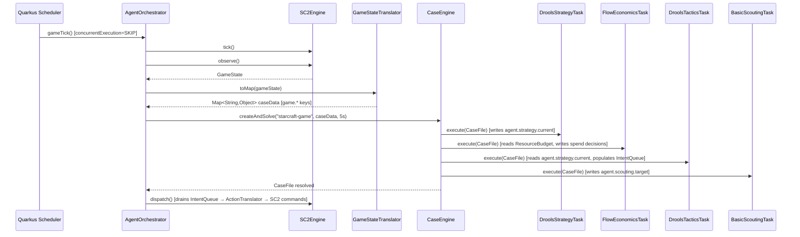
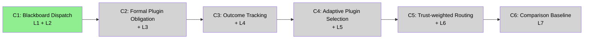

# QuarkMind — ARC42STORIES.MD

**Spec:** Arc42Stories v0.1
**Profile:** CaseHub — Application tier
**Profile ref:** `../parent/docs/arc42stories-casehub-profile.md` · fallback: `https://raw.githubusercontent.com/casehubio/parent/main/docs/arc42stories-casehub-profile.md`
**Prefix:** QM
**Status:** L1 conceptual + L2 complete. L3–L7 pending (#155–#159).

---

## §1 Introduction and Goals

### Description

QuarkMind is an **agentic harness for StarCraft II game AI** built on the CaseHub platform. It coordinates four specialist plugins — strategy, economics, tactics, scouting — via CaseHub's `CaseEngine` blackboard and plugin dispatch. Each game tick, `AgentOrchestrator` populates a `CaseFile` with SC2 observation state and invokes `caseEngine.createAndSolve()`, which dispatches all registered plugins against the shared blackboard. Plugins write their reasoning state back to the `CaseFile`; `AgentOrchestrator` drains the `IntentQueue` and issues SC2 commands.

QuarkMind has two distinct layers: the **harness layer** (`AgentOrchestrator`, `CaseFile`, plugin seam interfaces, foundation integration) and the **SC2 emulation layer** (`EmulatedGame`, `ReplayValidationHarness`, SC2 physics). This document covers the harness layer only. The SC2 emulation layer is domain-specific and is documented in `docs/DESIGN.md`.

**GitHub:** `mdproctor/quarkmind`

### Stakeholders

| Stakeholder | Interest |
|---|---|
| Game agent | Produces SC2 commands each tick via plugin coordination |
| Plugin authors | Implement specialist reasoning behind the `@CaseType("starcraft-game")` seam |
| Platform team | Validates CaseHub harness pattern at game-loop (22Hz) granularity |
| Architects / developers | Understand how to replicate the harness pattern in a different domain |

### Quality Goals

| Priority | Goal | Scenario |
|---|---|---|
| 1 | Plugin attribution | Every SC2 command traceable to the plugin that produced it |
| 2 | Formal DECLINE | A plugin outside its scope declares it structurally — no silent no-op |
| 3 | Content-driven dispatch | Plugins fire on blackboard conditions, not tick order |
| 4 | Trust-weighted routing | Repeated high-quality plugin outcomes earn dispatch priority |
| 5 | Game-loop latency | Full plugin dispatch completes within the 500ms tick interval |

### Artifact Schema

| Artifact type | Format | Example | Where it lives |
|---|---|---|---|
| Improvement log entry | `QM-NNN` | `QM-042` | `docs/PROGRESS.md` |
| Issue | `#NNN` or `mdproctor/quarkmind#NNN` | `#155` | GitHub Issues |
| Garden entry | `GE-YYYYMMDD-XXXXXX` | `GE-20260418-9b272f` | `~/.hortora/garden/` |
| Protocol | `PP-YYYYMMDD-XXXXXX` | `PP-20260601-5fa812` | `casehub-parent/docs/protocols/` |
| ADR | `ADR-NNNN` | `ADR-0007` | `docs/adr/` |
| Blog entry | `YYYY-MM-DD-[initials]NN-title` | `2026-04-06-mdp01-day-zero` | workspace `blog/` |
| Design spec | `YYYY-MM-DD-topic-design` | `2026-05-30-terran-zerg-emulated-mechanics-design` | `docs/superpowers/specs/` |

---

## §2 Constraints

### Platform

| Constraint | Value | Rationale |
|---|---|---|
| Java version | Java 21 (on Java 26 JVM) | Java 21 language features; JVM 26 for performance |
| Framework | Quarkus 3.34.2 | Ecosystem-wide version lock |
| Native target | GraalVM 25 | Production native image goal; non-native deps tracked in `NATIVE.md` |
| Build tool | Maven (not `./mvnw`) | Use system `mvn` |

```bash
JAVA_HOME=$(/usr/libexec/java_home -v 26) mvn clean install
```

### Architectural

- **Production-first constraint:** Before writing any class, apply: "Would this class exist in a production SC2 agent that does not include any later layer?" If no — do not build it.
- **Single-module structure:** QuarkMind uses one Quarkus Maven module (no `api/`/`app/` split). CDI displacement operates at the plugin level via `@CaseType` qualifier, not via `@DefaultBean`/`@Alternative` chain.
- **Harness/SC2 boundary:** Game knowledge (unit stats, build timings, physics) belongs in QuarkMind. Case lifecycle, binding conditions, trust, audit belong in the foundation.
- **Layering rule:** SC2 mechanics belong here. Foundation primitives (cases, commitments, trust, audit) are never re-implemented here.

### Dependencies

| Dependency | Status |
|---|---|
| `casehub-core` + `casehub-persistence-memory` | Local Maven install; no GitHub Packages |
| `drools-quarkus` + `drools-ruleunits-api/impl` 10.1.0 | ✅ Native-compatible (Executable Model) |
| `quarkus-flow` | ✅ Quarkus-native |
| `ocraft-s2client` | ❌ JVM-only — tracked in `NATIVE.md` |
| `scelight-mpq` + `scelight-s2protocol` | ❌ JVM-only — tracked in `NATIVE.md` |

---

## §3 Context and Scope



### Boundary Rules

**QuarkMind harness owns:** `AgentOrchestrator`, `GameStateTranslator`, `QuarkMindCaseFile` key constants, plugin seam interfaces (`StrategyTask`, `EconomicsTask`, `TacticsTask`, `ScoutingTask`), active plugin implementations, `IntentQueue` drain, SC2 command translation. Trust thresholds for game domains (when L6 lands).

**SC2 emulation layer owns:** `EmulatedGame`, `RaceModel`, `ReplayValidationHarness`, `ReplaySimulatedGame`, `SC2Data`, all SC2 physics — not part of the harness architecture record.

**Foundation owns:** case lifecycle, binding conditions, plugin DECLINE/FAILURE routing, inter-plugin messaging (qhorus), audit trail and trust scoring (ledger).

See `../parent/docs/PLATFORM.md` Capability Ownership table for the full boundary map.

---

## §4 Solution Strategy

### Core Architectural Patterns

| Pattern | QuarkMind expression |
|---|---|
| **Hexagonal** | Plugin seam interfaces in `agent/plugin/`; active implementations in `plugin/`; `SC2Engine` seam abstracts real/emulated/replay SC2 |
| **Strategy** | Each plugin seam accepts any `@CaseType("starcraft-game") @ApplicationScoped` implementation — swap without touching `AgentOrchestrator` |
| **Blackboard** | `CaseFile` per-tick shared state; all plugins read from and write to the same map; no direct inter-plugin calls |
| **Event-Driven** | `@Scheduled gameTick()` drives the loop; `@ObservesAsync` for any asynchronous plugin outcomes |

See `../parent/docs/ARCHITECTURE.md` for full pattern definitions and invariants.

### Layer Taxonomy

QuarkMind follows the CaseHub harness integration sequence with one deviation: `casehub-engine` was integrated first (L2), before qhorus and ledger. `casehub-work` is not used — there are no human task lifecycle requirements in a game agent.

| Layer | Foundation module | Reading order | Build status |
|---|---|---|---|
| Naive Game Loop | *(none — conceptual baseline)* | L1 | Conceptual only — never deployed |
| casehub-engine | `casehub-engine` + `casehub-persistence-memory` | L2 | ✅ complete (#28, #139) |
| casehub-qhorus | `casehub-qhorus` | L3 | 🔲 pending (#155) |
| casehub-ledger | `casehub-ledger` (lightweight mode — casehubio/ledger#114) | L4 | 🔲 pending (#156) |
| Adaptive plugin selection | `casehub-engine` binding conditions | L5 | ✅ complete (#157) |
| Trust routing | `casehub-engine-ledger` (Bayesian Beta CAPABILITY — EigenTrust inert, ADR-0009) | L6 | 🔲 pending (#158) |
| Comparison baseline | *(none — analysis only)* | L7 | 🔲 pending (#159) |

**Note on reading vs build order:** L2 was built first because the CaseEngine blackboard was the architectural priority. L3–L7 follow the CaseHub integration sequence. Layer ordering above is reading order (learning progression); build order is reflected in the blog entries.

### `@CaseType` CDI Qualification — the QuarkMind Displacement Pattern

QuarkMind has no `api/`/`app/` module split and does not use `@DefaultBean`. Plugin displacement uses `@CaseType("starcraft-game")` qualifier: `CaseEngine` selects the active implementation by qualifier match. Each layer adds or replaces a `@ApplicationScoped @CaseType("starcraft-game")` implementation behind the seam interface. `QuarkMindTaskRegistrar` injects all four seams at startup to prevent Arc bean pruning.

```java
// Plugin seam — zero logic; extends TaskDefinition
public interface StrategyTask extends TaskDefinition {}

// Active implementation — @CaseType makes CaseEngine select it
@ApplicationScoped
@CaseType("starcraft-game")
public class DroolsStrategyTask implements StrategyTask { ... }
```

This differs from devtown's `@DefaultBean` pattern: there is no baseline bean that remains displaced — each layer ships exactly one active implementation per seam.

### Chapter Sequencing Rationale (summary — full rationale in §9.2)

- C1 before C2: blackboard (L2) is the runtime substrate; qhorus inter-plugin messaging depends on it
- C2 before C3: formal plugin obligation tracking is meaningful only when inter-plugin channels exist
- C3 before C4: ledger entries for plugin decisions depend on the commitment chain qhorus produces
- C4 before C5: adaptive binding selection and trust routing both read ledger attestation data
- L2 built before L3–L7 in actual delivery: Chapter ordering is reading order, not build order

---

## §5 Building Block View

### Layer Architecture View

Current delivery state — L1 (conceptual) and L2 (complete). L3–L7 added as Chapters C2–C6 ship.



### Single-Module Package Structure

```
src/main/java/io/quarkmind/
  domain/              Plain Java records — no framework deps; always native-safe
  sc2/                 SC2Engine seam — IntentQueue, sealed Intent, game events
  sc2/real/            Live SC2: RealSC2Client, SC2BotAgent, ObservationTranslator, ActionTranslator
  sc2/mock/            Mock SC2: SimulatedGame (scripted test oracle), MockGameObserver
  sc2/emulated/        Physics sim: EmulatedGame, EmulatedEngine, RaceModel, SC2Data
  sc2/replay/          Replay: ReplayEngine, ReplaySimulatedGame, GameEventStream, AbilityMapping
  agent/               AgentOrchestrator, GameStateTranslator, QuarkMindCaseFile
  agent/plugin/        Plugin seam interfaces (StrategyTask, EconomicsTask, TacticsTask, ScoutingTask)
  plugin/              Active plugin implementations
  plugin/drools/       Drools Rule Units: StrategyRuleUnit, TacticsRuleUnit, ScoutingRuleUnit, .drl files
  plugin/flow/         Quarkus Flow: EconomicsFlow, FlowEconomicsTask
  plugin/scouting/     Drools CEP scouting: DroolsScoutingTask, ScoutingSessionManager
  plugin/tactics/      GOAP planning + CDI strategy interfaces
  qa/                  QA REST endpoints — @UnlessBuildProfile("prod")
```

---

## §6 Runtime View

### Scenario — Per-tick blackboard dispatch (L2)

Each 500ms scheduler tick: `AgentOrchestrator` populates the `CaseFile` from SC2 observation state, dispatches all plugins via `caseEngine.createAndSolve()`, then drains `IntentQueue` to SC2 commands.



**Not shown:** `@Scheduled(concurrentExecution = SKIP)` — if the previous tick's `createAndSolve()` has not completed, the next firing is silently skipped. This prevents tick accumulation under load.

---

## §7 Deployment View

```
Developer machine / CI:
  JAVA_HOME=$(/usr/libexec/java_home -v 26) mvn clean install

Quarkus profiles:
  %mock (default)  — SimulatedGame; no SC2 binary required
  %emulated        — EmulatedGame physics; Three.js visualizer at localhost:8080/visualizer.html
  %replay          — ReplayEngine (observe-only); agent loop against a .SC2Replay file
  %sc2             — RealSC2Client; live SC2 binary required
  %test            — @QuarkusTest; scheduler disabled; gameTick() called directly
  %prod            — QA endpoints stripped (@UnlessBuildProfile("prod"))

Native image target:
  GraalVM 25; non-native deps (ocraft, scelight) tracked in NATIVE.md
  Build: mvn package -Dnative (ocraft/scelight block native until alternatives found)

Electron wrapper (optional):
  electron-app/main.js spawns Quarkus as subprocess; health-polls; opens OS window
  Build jar for Electron: mvn package -DskipTests -Dquarkus.profile=replay
```

**Log rotation:** `%emulated` profile caps at 20M, 3 backups at `/tmp/quarkmind-emulated.log*`. Never redirect `quarkus:dev` stdout to a file without size limits — game loop logs every tick.

---

## §8 Crosscutting Concepts

### Protocol References

| Concern | Protocol / Reference |
|---|---|
| SC2 physics constants (train times, build times) | `docs/protocols/sc2data-train-times-require-calibration.md` — calibrate from replay data, not formula |
| Sealed Intent exhaustiveness | `GE-20260418-9b272f` — update `Intent.java` permits clause AND all switch expressions in one commit |
| Plugin seam placement | Seam interfaces in `agent/plugin/`; active implementations in `plugin/` |
| CaseFile key namespaces | `game.*` written by `GameStateTranslator` only; `agent.*` written by plugins only |
| Architectural patterns | `../parent/docs/ARCHITECTURE.md` |
| Capability ownership | `../parent/docs/PLATFORM.md` Capability Ownership table |
| Harness pattern | `../parent/docs/AGENTIC-HARNESS-GUIDE.md` |

### Anti-patterns

These have occurred in QuarkMind or are the most likely mistakes when extending the harness layer.

- **Arc bean pruning silences a plugin**
  - **Symptom:** `caseEngine.createAndSolve()` completes with no plugin output; `TaskDefinitionRegistry` is empty at runtime
  - **Cause:** Quarkus Arc removes `@CaseType` beans as "unused" when nothing injects them by the typed seam interface — Arc sees no injection point and eliminates the bean at build time
  - **Fix:** Ensure `QuarkMindTaskRegistrar` injects each plugin via its seam interface (`@Inject @CaseType("starcraft-game") StrategyTask strategyTask`). One `@Inject` per seam is sufficient; the registrar also registers the bean with `TaskDefinitionRegistry`

- **Concurrent tick execution stalls the game loop**
  - **Symptom:** Game loop threads accumulate; Drools evaluation or Flow execution delays cascade; memory pressure grows across ticks
  - **Cause:** `@Scheduled` without `concurrentExecution = SKIP` allows the next tick to fire before the previous one completes; at 500ms intervals, a slow plugin creates unbounded concurrency
  - **Fix:** `@Scheduled(every = "...", concurrentExecution = ConcurrentExecution.SKIP)` on `AgentOrchestrator.gameTick()`; this is non-negotiable at game-loop timing

- **Plugin writes to `game.*` CaseFile namespace**
  - **Symptom:** Observation state mutated mid-tick; downstream plugins in the same `createAndSolve()` cycle read stale or corrupted game state
  - **Cause:** Plugin writes to a `game.*` key that `GameStateTranslator` owns — next tick the translator overwrites it, but within-tick reads are corrupted
  - **Fix:** Plugins write only to `agent.*` keys; `GameStateTranslator` writes only to `game.*` keys; document each key in `QuarkMindCaseFile` with owner and readers

- **`ClassTooLargeException` on startup after large enum or switch change**
  - **Symptom:** `quarkus:dev` fails at augmentation with `ClassTooLargeException`
  - **Cause:** Quarkus generates a startup class that accumulates across enum additions and sealed switch expressions; stale augmentation cache exceeds JVM bytecode limit
  - **Fix:** Run `mvn clean` before `quarkus:dev`; clean removes the stale augmentation cache

---

## §9 Journeys and Chapters

### §9.1 Journey Overview

| Journey | Description | Chapters | Status |
|---|---|---|---|
| Game Agent Coordination | A StarCraft II agent coordinates specialist plugins via CaseHub harness — dispatching strategy, economics, tactics, and scouting on a shared blackboard each tick, with formal plugin obligations, outcome tracking, adaptive routing, and trust-weighted dispatch | 6 | In progress (C1 complete) |

### §9.2 Chapter Index



| # | Chapter | Journey | Layers touched | Delta | Status |
|---|---|---|---|---|---|
| 1 | Blackboard dispatch | Game Agent Coordination | L1, L2 | Conceptual, High | ✅ complete |
| 2 | Formal plugin obligation | Game Agent Coordination | + L3 | Low | 🔲 pending (#155) |
| 3 | Outcome tracking | Game Agent Coordination | + L4 | Medium | 🔲 pending (#156) |
| 4 | Adaptive plugin selection | Game Agent Coordination | + L5 | Medium | 🔲 pending (#157) |
| 5 | Trust-weighted routing | Game Agent Coordination | + L6 | Medium | 🔲 pending (#158) |
| 6 | Comparison baseline | Game Agent Coordination | L7 | Low | 🔲 pending (#159) |

**Layer × Chapter matrix**

| Layer | C1 ✅ | C2 🔲 | C3 🔲 | C4 🔲 | C5 🔲 | C6 🔲 |
|---|---|---|---|---|---|---|
| L1 Naive Game Loop | High | — | — | — | — | — |
| L2 casehub-engine | High | Low | Low | Low | Low | Low |
| L3 casehub-qhorus | — | Low | — | — | — | — |
| L4 casehub-ledger | — | — | Medium | Low | Low | — |
| L5 Adaptive selection | — | — | — | Medium | Low | — |
| L6 Trust routing | — | — | — | — | Medium | — |
| L7 Comparison | — | — | — | — | — | Low |

L2 participates in every Chapter — it is the foundational dispatch layer. L3 and L5 are each additive (one Chapter at Low/Medium, stable thereafter). L4 participates in three Chapters — it provides both the audit record (C3) and the trust data that C4 and C5 read.

**Sequencing rationale:**
- C1 before C2: `caseEngine.createAndSolve()` (L2) is the runtime substrate; qhorus inter-plugin channels run on top of it
- C2 before C3: plugin obligation records (L3 commitment chain) are the ledger entries that make outcome tracking meaningful in C3
- C3 before C4: adaptive binding selection reads ledger attestations to decide which plugin to dispatch
- C4 before C5: trust-weighted routing reads the trust scores accumulated from L4 attestations
- L2 built before L3–L7 in actual delivery: C1 completed first because the CaseEngine blackboard was the architectural priority

---

### §9.3 Chapter Entries

---

#### Chapter 1 — Blackboard Dispatch

**Journey:** Game Agent Coordination | **Sequence:** 1 of 6 | **Status:** ✅ complete
**Delivered:** 2026-04-06 (initial), formalised 2026-05-25 (#139) | **Issues:** #28, #139 | **Blog:** `blog/2026-04-06-mdp01-day-zero.md`; `blog/2026-04-06-mdp02-phase-0-mock-that-runs.md`

**What this delivers**
The game agent dispatches all four specialist plugins (strategy, economics, tactics, scouting) via a shared `CaseFile` blackboard every tick. Plugins read observation state from the blackboard and write reasoning state back — `StrategyTask` output is readable by `TacticsTask` within the same tick. Every SC2 command is traceable to the plugin that populated the `IntentQueue`. L1 is documented as the accountability gap baseline; no L1 code was deployed.

**Accountability gaps closed**
- No inter-plugin communication (L1 gap) → `CaseFile` blackboard via L2
- No formal plugin dispatch (L1 gap) → `caseEngine.createAndSolve()` manages task lifecycle via L2
- No outcome tracking → 🔲 C3

**Layer Impact**
| Layer | Delta |
|---|---|
| L1 Naive Game Loop | High — conceptual baseline; gap comments establish what L2 closes |
| L2 casehub-engine | High — `AgentOrchestrator`, `GameStateTranslator`, `QuarkMindCaseFile`, four seam interfaces, four active plugins, `QuarkMindTaskRegistrar` |

---

#### Chapter 2 — Formal Plugin Obligation

**Journey:** Game Agent Coordination | **Sequence:** 2 of 6 | **Status:** 🔲 pending

🔲 Full Chapter entry at C2 close. Blocked on casehub-qhorus integration (#155).

Known scope: typed COMMAND/RESPONSE between plugin agents; DECLINE recorded structurally when a plugin is out-of-scope; commitment lifecycle per plugin engagement; `MessageLedgerEntry` per speech act.

---

#### Chapter 3 — Outcome Tracking

**Journey:** Game Agent Coordination | **Sequence:** 3 of 6 | **Status:** 🔲 pending

🔲 Full Chapter entry at C3 close. Blocked on casehub-ledger lightweight mode (casehubio/ledger#114) and #156.

Known scope: plugin outcome recording (plugin ID, decision, game state context, result); Bayesian Beta trust scoring per plugin (EigenTrust not activated — ADR-0009); async non-blocking writes; in-memory backend for mock/emulated profiles.

---

#### Chapter 4 — Adaptive Plugin Selection

**Journey:** Game Agent Coordination | **Sequence:** 4 of 6 | **Status:** 🔲 pending

🔲 Full Chapter entry at C4 close. L5 (#157) complete — blocked on L3 (#155) and L4 (#156) to tell the full story.

Known scope: `casehub-engine` binding conditions evaluate game state; plugins dispatched only when conditions are satisfied (e.g. `TacticsTask` skips when no enemy units); removes hardwired all-plugins-every-tick dispatch.

---

#### Chapter 5 — Trust-weighted Routing

**Journey:** Game Agent Coordination | **Sequence:** 5 of 6 | **Status:** 🔲 pending

🔲 Full Chapter entry at C5 close. Blocked on casehubio/ledger#114 and #158.

Known scope: `TrustWeightedAgentStrategy` (or equivalent) selects among competing plugin implementations by outcome history; routing quality improves as attestations accumulate.

---

#### Chapter 6 — Comparison Baseline

**Journey:** Game Agent Coordination | **Sequence:** 6 of 6 | **Status:** 🔲 pending

🔲 Full Chapter entry at C6 close. Blocked on #159.

Known scope: benchmark QuarkMind harness agent against the naive game loop baseline (L1) and available commercial SC2 frameworks; document win-rate delta and latency delta attributable to each layer.

---

### §9.4 Layer Entries

---

### Layer — Naive Game Loop

**Participates in chapters:** C1
**Architectural patterns:** *(none — accountability gap baseline; no production code)*
**Key protocols:** *(none)*
**Design refs:** `LAYER-LOG.md §Layer 1`
**Issues:** #28 (CaseHub integration commit — L2 was the first production game loop)
**Navigation:** `git log --grep="#28" --oneline`
**Blog:** `blog/2026-04-06-mdp01-day-zero.md`
**Completed:** Conceptual only — never deployed as code

#### What it adds

**Before:** No CaseHub harness.
**After:** *(conceptual)* A `@Scheduled` game loop calls each plugin directly with the raw `GameState`. No shared blackboard; no per-tick state sharing between plugins; no adaptive dispatch; no outcome tracking.

This layer is the accountability gap baseline. It was never deployed — QuarkMind's first `AgentOrchestrator` already used `CaseEngine` (L2). The entry documents the coordination requirements that L2 closes and names the gaps that subsequent layers address.

What this layer cannot do:
- **No shared state** — each plugin receives only the raw `GameState`; `StrategyTask` output is invisible to `TacticsTask` within the same tick
- **No adaptive routing** — all four plugins fire every tick regardless of game state; `TacticsTask` runs even when no enemy units are present
- **No outcome tracking** — no record of which plugin made which decision or whether the resulting intent improved the game outcome
- **No resilience** — if `EconomicsTask` throws, the tick fails with no partial record

Not closed here: all four gaps. Each is closed by a subsequent layer.

#### Accountability gaps closed

None — this layer establishes the gaps.

| Gap established | What breaks | Closed by |
|---|---|---|
| No inter-plugin communication | `StrategyTask` intent not visible to `TacticsTask` same tick | L2 (`CaseFile` blackboard) |
| No adaptive dispatch | All plugins fire every tick; no capability-based selection | L5 (binding conditions) |
| No outcome tracking | No basis for trust scoring or performance comparison | L4 (ledger) |
| No formal DECLINE | Plugin outside scope silently fails or throws | L3 (qhorus DECLINE speech act) |

#### Key files

No production code for L1. Hypothetical naive loop for reference:

```java
// Hypothetical naive orchestrator — the pattern L2 replaced
@Scheduled(every = "${starcraft.tick.interval:500ms}")
void gameTick() {
    engine.tick();
    GameState state = engine.observe();   // raw snapshot, no blackboard

    strategyTask.solve(state);            // call order arbitrary; no declared dependencies
    scoutingTask.solve(state);            // cannot read strategyTask output this tick
    tacticsTask.solve(state);
    economicsTask.solve(state);

    engine.dispatch();
}
```

#### Key wiring

None — this layer has no production wiring.

#### Architectural decisions

**Why document L1 if it was never deployed:** L1 is the comparison baseline that makes each subsequent layer's value explicit. Without L1, the gap comments in LAYER-LOG.md lose their teaching anchor. The gap table above is the primary content of this layer entry — it names the coordination requirements that shaped the layer sequence.

#### Pattern introduced

*(none — accountability gap baseline)*

#### Pattern anchor

*(none)*

#### Gotchas

None specific to L1. No framework dependencies, no CDI, no shared state.

#### Pattern to replicate

Replicate the gap baseline in a different domain:

1. Define one plugin seam interface per agent concern (e.g. `StrategyTask`, `EconomicsTask`).
2. Write the naive loop: `tick → observe → call each seam directly with domain state → dispatch`.
3. Add gap comments naming the coordination requirement each gap represents — these become the audit record of what the harness closes.
4. Write unit tests for each plugin independently with plain `new`; no CDI or framework required.
5. Do NOT add inter-plugin communication at this layer — that is the gap L2 closes.

---

### Layer — casehub-engine

**Participates in chapters:** C1, C2, C3, C4, C5
**Architectural patterns:** Blackboard, Hexagonal (plugin seam interfaces as ports), Strategy (`@CaseType` qualifier selection)
**Key protocols:** `agent/plugin/` seam interfaces only; active implementations in `plugin/` — never invert; `game.*` / `agent.*` CaseFile namespace split
**Design refs:** `docs/superpowers/specs/` (initial design 2026-04-06)
**Issues:** #28 (CaseHub integration), #139 (formal documentation)
**Navigation:** `git log --grep="#139" --oneline`
**Blog:** `blog/2026-04-06-mdp01-day-zero.md`; `blog/2026-04-06-mdp02-phase-0-mock-that-runs.md`; `blog/2026-05-08-mdp01-clean-desk-bigger-picture.md` (harness framing)
**Completed:** 2026-04-06 (initial); formalised 2026-05-25

#### What it adds

**Before:** Naive game loop — direct plugin calls; no shared state between plugins within a tick.
**After:** `caseEngine.createAndSolve("starcraft-game", caseData, timeout)` dispatches all `@CaseType("starcraft-game")` plugins against a shared `CaseFile`; `GameStateTranslator` populates `game.*` keys from the SC2 observation; plugins read `game.*` and write `agent.*`.

What L2 adds:
- **Per-tick blackboard** — `CaseFile` shared state; `StrategyTask` writes `agent.strategy.current`; `TacticsTask` reads it in the same `createAndSolve()` cycle
- **Formal plugin dispatch** — `CaseEngine` manages task lifecycle; plugin exceptions are isolated per task
- **`@CaseType` qualification** — active implementation selected by qualifier; swap by providing a new `@ApplicationScoped @CaseType("starcraft-game")` bean
- **`QuarkMindCaseFile`** — all key constants in one class; raw string keys forbidden elsewhere

Not closed here: adaptive dispatch (L5), outcome tracking (L4), formal DECLINE (L3).

#### Accountability gaps closed

| Gap | What breaks without it | Closed by |
|---|---|---|
| No inter-plugin communication | `StrategyTask` output invisible to `TacticsTask` same tick | `CaseFile` blackboard — `game.*` / `agent.*` shared state |
| No formal plugin lifecycle | Plugin exception silently aborts the tick | `caseEngine.createAndSolve()` task lifecycle isolation |

#### Key files

- `agent/AgentOrchestrator.java` — `@Scheduled gameTick()`: tick → translate → `caseEngine.createAndSolve()` → dispatch; `concurrentExecution = SKIP`
- `agent/GameStateTranslator.java` — maps `GameState` to `Map<String, Object>` using `QuarkMindCaseFile` keys; writes only `game.*`
- `agent/QuarkMindCaseFile.java` — all `CaseFile` key constants; `game.*` for observation, `agent.*` for plugin reasoning
- `agent/QuarkMindTaskRegistrar.java` — injects all four plugin seams at startup; registers with `TaskDefinitionRegistry`; prevents Arc bean pruning
- `agent/plugin/StrategyTask.java` — plugin seam interface; extends `TaskDefinition`; no game logic
- `agent/plugin/EconomicsTask.java` — plugin seam interface
- `agent/plugin/TacticsTask.java` — plugin seam interface
- `agent/plugin/ScoutingTask.java` — plugin seam interface
- `plugin/DroolsStrategyTask.java` — `@ApplicationScoped @CaseType("starcraft-game")`; Drools Rule Units; reads `game.*`, writes `agent.strategy.current`
- `plugin/flow/FlowEconomicsTask.java` — `@ApplicationScoped @CaseType("starcraft-game")`; Quarkus Flow; reads `ResourceBudget`, writes spend decisions
- `plugin/DroolsTacticsTask.java` — `@ApplicationScoped @CaseType("starcraft-game")`; Drools + GOAP; reads `agent.strategy.current`, populates `IntentQueue`
- `plugin/scouting/DroolsScoutingTask.java` — `@ApplicationScoped @CaseType("starcraft-game")`; Drools CEP; writes `agent.scouting.target`

#### Key wiring

**`QuarkMindTaskRegistrar` prevents Arc bean pruning.** Quarkus Arc removes `@CaseType` beans as "unused" when no injection point references them by qualified type. `QuarkMindTaskRegistrar` injects each plugin via its typed seam interface (`@Inject @CaseType("starcraft-game") StrategyTask strategyTask`) and registers it with `TaskDefinitionRegistry` at startup. Without this registrar, `TaskDefinitionRegistry` is empty at runtime and `createAndSolve()` completes silently with no plugin output.

**`@Scheduled(concurrentExecution = SKIP)` is non-negotiable.** At 500ms tick intervals, Drools evaluation or Quarkus Flow execution can exceed the tick duration. Without `SKIP`, the scheduler accumulates concurrent tick executions that cascade into an unbounded thread pool. `SKIP` ensures each tick completes before the next fires — stalled ticks drop rather than stack.

**CaseFile key namespace split.** `game.*` keys are written exclusively by `GameStateTranslator` from SC2 observation state. `agent.*` keys are written exclusively by plugins as reasoning outputs. A plugin writing to `game.*` corrupts observation state for other plugins in the same tick. Document each key in `QuarkMindCaseFile` with its owner and readers.

**`casehub-persistence-memory` is a required runtime dependency.** `CaseEngine` injects `TaskRepository` and `CaseFileRepository` from the persistence module. Without it on the classpath, CDI startup fails. `quarkus.index-dependency` is also required — `casehub-persistence-memory` lacks `META-INF/jandex.idx`; Quarkus skips CDI scanning of jars without it.

**`@Scheduled(every = ...)` uses property placeholder.** `starcraft.tick.interval` defaults to 500ms in `application.properties`. The `%test` profile disables the scheduler entirely — `@QuarkusTest` calls `orchestrator.gameTick()` directly without timing coupling.

#### Architectural decisions

**Why `@CaseType` qualifier rather than `@DefaultBean` displacement:** QuarkMind uses a single Maven module with no `api/`/`app/` split. There are no downstream JPA consumers. `@DefaultBean` displacement targets the devtown pattern where a naive `@DefaultBean` service in `app/` is displaced by a more capable implementation in `review/`. QuarkMind has no equivalent module boundary; `@CaseType` qualification on the seam interface achieves the same selection without requiring a multi-module structure. Tradeoff: there is no always-present baseline bean — each layer must provide exactly one active implementation per seam.

**Why sealed `Intent` interface:** Compiler-enforced switch exhaustiveness. A new `Intent` subtype cannot silently fall through to a `default` no-op in `ActionTranslator` or elsewhere. When `Intent.java` permits clause changes, all switch expressions over `Intent` fail to compile — the compiler surfaces every unhandled case immediately. Tradeoff: adding a new Intent type requires updating all switch expressions in the same commit (documented: GE-20260418-9b272f).

**Why `GameStateTranslator` is a separate class from `AgentOrchestrator`:** `GameStateTranslator.toMap()` is independently unit-testable without constructing a `CaseEngine`. Tests for translator logic use plain `new GameStateTranslator()`. If translation logic lived in `AgentOrchestrator`, it would require a `@QuarkusTest` to test — significant boot overhead for pure data transformation.

#### Pattern introduced

**`@CaseType` CDI qualification** — one `@ApplicationScoped @CaseType("case-type-name")` implementation per plugin seam; `CaseEngine` selects by qualifier match; `QuarkMindTaskRegistrar` ensures beans survive Arc pruning.

#### Pattern anchor

`agent/AgentOrchestrator.java` (`gameTick()`) + `agent/QuarkMindTaskRegistrar.java` (injection and registration pattern)

#### Gotchas

- **Arc bean pruning**
  - **Symptom:** `caseEngine.createAndSolve()` completes with no plugin output; logs show no task executions; `TaskDefinitionRegistry.findAll()` returns empty
  - **Cause:** Arc removes `@CaseType` beans at build time when no injection point references them; the registry is populated at startup from injected beans only
  - **Fix:** Add `@Inject @CaseType("starcraft-game") StrategyTask strategyTask` in `QuarkMindTaskRegistrar` for each seam — one injection point per seam is sufficient

- **Concurrent tick accumulation**
  - **Symptom:** Thread pool grows over time; heap pressure increases; game loop falls behind real-time; multiple overlapping `createAndSolve()` calls visible in thread dumps
  - **Cause:** `@Scheduled` without `concurrentExecution = SKIP` fires the next tick before the previous completes; at 500ms intervals, any plugin exceeding tick duration creates compounding concurrency
  - **Fix:** `concurrentExecution = ConcurrentExecution.SKIP` on `gameTick()` — slow ticks drop; they do not stack

- **`game.*` / `agent.*` namespace violation**
  - **Symptom:** Downstream plugins in the same tick read stale or zero-value game state despite SC2 observation being non-zero; next tick restores correct values
  - **Cause:** A plugin wrote to a `game.*` key, which `GameStateTranslator` overwrites next tick — within-tick reads of that key are corrupted for other plugins
  - **Fix:** Audit all `CaseFile.put()` calls in plugins; any key starting with `game.` must move to `agent.` and be renamed accordingly

- **`ClassTooLargeException` after large enum or switch additions**
  - **Symptom:** `quarkus:dev` fails at augmentation phase with `ClassTooLargeException`
  - **Cause:** Quarkus augmentation generates a startup class that grows with each enum entry and sealed switch arm; stale cache exceeds JVM class size limit
  - **Fix:** `mvn clean` before `quarkus:dev` — removes stale augmentation output; no code change required

#### Pattern to replicate

Replicate the casehub-engine blackboard harness in a different domain:

1. Add `casehub-engine` and `casehub-persistence-memory` as runtime dependencies. Add `quarkus.index-dependency` for `casehub-persistence-memory` in `application.properties` — it lacks `jandex.idx`.
2. Create a `DomainCaseFile` class with one constant per `CaseFile` key. Namespace observation state as `domain.*` and plugin reasoning state as `agent.*`. Never use raw string keys elsewhere.
3. Create a `DomainStateTranslator` that maps your domain observation type to `Map<String, Object>` using `DomainCaseFile` constants. Write only `domain.*` keys here.
4. Define one plugin seam interface per agent concern, each extending `TaskDefinition`. Add no logic to the seam interfaces — they are ports only.
5. Implement each plugin as `@ApplicationScoped @CaseType("your-case-type")`. Plugins read from `CaseFile` and write to `CaseFile`; no direct inter-plugin calls.
6. Create a `DomainTaskRegistrar` that `@Inject`s each plugin via its typed seam interface and registers it with `TaskDefinitionRegistry` at startup. This is mandatory — without it, Arc removes the beans.
7. Wire `AgentOrchestrator`: `tick → translate → caseEngine.createAndSolve("your-case-type", caseData, timeout) → dispatch`.
8. Add `@Scheduled(concurrentExecution = SKIP)` if your domain has a fixed tick interval with latency requirements.
9. Write a `@QuarkusTest` that calls `orchestrator.tick()` directly with the scheduler disabled — verifies full plugin dispatch without timing coupling.

---

### Layer — casehub-qhorus

**Participates in chapters:** C2
**Completed:** 🔲 pending (#155)

🔲 Full entry at C2 close. Known scope: typed COMMAND/RESPONSE between plugins; DECLINE speech act; commitment lifecycle; `MessageLedgerEntry` per speech act.

---

### Layer — casehub-ledger

**Participates in chapters:** C3, C4, C5
**Completed:** 🔲 pending (#156, blocked on casehubio/ledger#114)

🔲 Full entry at C3 close. Known scope: plugin outcome recording without cryptographic signing; Bayesian Beta trust scoring per plugin; async non-blocking writes at game-loop granularity; in-memory backend for mock/emulated profiles. Lightweight mode required — tamper-evident guarantees not needed for game agent decisions.

---

### Layer — Adaptive Plugin Selection

**Participates in chapters:** C4, C5
**Completed:** ✅ 2026-06-03 (#157, commit 2d1dce8)

`entryCriteria()` on each plugin declares the CaseFile keys that must be present before the plugin activates. The CaseEngine evaluates criteria after each task completes; newly written keys can unlock blocked tasks in the same tick (re-evaluation loop).

Two distinct uses of `entryCriteria()` emerged:

**Ordering dependency** — `ENEMY_ARMY_SIZE` on `StrategyTask`: scouting always writes this key (even as 0), so strategy always runs after scouting. The criterion enforces execution order without causing genuine skipping. C2 (#169) will migrate strategy's Drools data feed to use scouting-derived intel (`ENEMY_POSTURE`, `ENEMY_BUILD_ORDER`), at which point the dependency becomes a genuine data dependency rather than a sequencing constraint.

**Conditional gate** — `NEAREST_THREAT` on `TacticsTask`: scouting writes this key only when `!enemies.isEmpty()`. When no enemies are visible, the key is absent and tactics is skipped entirely. This is the genuinely adaptive behaviour: the platform decides whether tactics has any work to do without the plugin being invoked.

**Dependency graph:**
```
Scouting   {READY}                             → writes ENEMY_ARMY_SIZE, NEAREST_THREAT (conditional), ...
Economics  {READY}                             → independent
Strategy   {READY, ENEMY_ARMY_SIZE}   [order]  → writes STRATEGY
Tactics    {READY, STRATEGY, NEAREST_THREAT}   → [order on STRATEGY, gate on NEAREST_THREAT]
```

**Implementation finding:** `TaskDefinition.canActivate()` in the installed casehub-core snapshot unconditionally returns `true` — it does not evaluate `entryCriteria()`. All four plugin classes now explicitly override `canActivate()` with `entryCriteria().stream().allMatch(caseFile::contains)`. Overrides are documented with a comment referencing the defect; they can be removed once the foundation corrects the default.

**`GameTickExecutor`** was extracted from `AgentOrchestrator.gameTick()` to capture the `CaseFile` returned by `createAndSolve()` (previously discarded) and surface it via `AgentOrchestrator.getLastTickResult()`. Note: `createAndSolve()` returns the pre-solve CaseFile (translator-written keys only); plugin-written keys are absent from the returned reference. Tests for this layer call `canActivate()` directly on the injected CDI beans to verify gate semantics independently of the async solve.

🔲 Full Chapter entry at C4 close (waiting on L3 #155 and L4 #156).

---

### Layer — Trust Routing

**Participates in chapters:** C5
**Completed:** 🔲 pending (#158, blocked on casehubio/ledger#114)

🔲 Full entry at C5 close. Known scope: `TrustWeightedAgentStrategy` (via `casehub-engine-ledger`) selects among competing plugin implementations by Bayesian Beta CAPABILITY score; EigenTrust GLOBAL computation runs but is inert — GLOBAL scores are not consumed for capability routing (ADR-0009); trust scores accumulate from plugin outcome attestations written in L4; routing quality improves automatically across game sessions.

---

### Layer — Comparison Baseline

**Participates in chapters:** C6
**Completed:** 🔲 pending (#159)

🔲 Full entry at C6 close. Known scope: benchmark QuarkMind harness agent against L1 naive loop and available commercial SC2 frameworks; document win-rate and latency delta per layer.

---

## §10 Architectural Decisions

ADR-0001 through ADR-0008 are captured in `docs/adr/`. Only cross-cutting decisions not captured inline in layer entries appear here.

### No casehub-work integration

**Date:** 2026-04-06
**Context:** CaseHub harness apps typically integrate `casehub-work` for human task lifecycle (WorkItem, SLA, escalation). QuarkMind coordinates machine plugins only — no human reviewers, no human task gates.
**Decision:** `casehub-work` is not integrated. QuarkMind skips L2 of the standard CaseHub taxonomy (casehub-work) and integrates casehub-qhorus as L3 instead.
**Consequences:** The layer taxonomy deviates from the CaseHub profile default. Plugin obligations are tracked via casehub-qhorus commitment lifecycle rather than WorkItem SLA. No `SlaBreachPolicy`, no `claimDeadline`, no escalation chain.

### Single-module architecture

**Date:** 2026-04-06
**Context:** CaseHub application-tier apps (devtown, AML) use a `domain/`/`review-or-integration/`/`app/` three-tier module structure enforcing the dependency rule. QuarkMind has no downstream JPA consumers and no requirement for the dependency rule at module level.
**Decision:** Single Quarkus Maven module. CDI boundary is enforced by package placement (`agent/plugin/` for seam interfaces; `plugin/` for implementations) and by code convention, not module dependency rules.
**Consequences:** Cannot enforce the dependency rule via Maven `<scope>` exclusions. Package conventions are the only enforcement mechanism — they must be maintained by discipline. Simplifies build and dependency management significantly.

---

## §11 Quality Requirements

| Priority | Scenario | Metric |
|---|---|---|
| Game-loop latency | Full `createAndSolve()` with all four plugins completes within 500ms tick interval | P99 < 400ms (leave 100ms headroom for SC2 I/O) |
| Plugin attribution | Every `IntentQueue` entry traceable to the seam that produced it | 100% (enforced by `CaseFile` key ownership) |
| Test coverage | Harness layer tests run without a live SC2 binary | `mvn test` passes in `%mock` profile |
| Native compatibility | Non-native deps isolated behind CDI seams and tracked | `NATIVE.md` covers all JVM-only deps |

---

## §12 Risks and Technical Debt

| Risk / Debt | Severity | Notes |
|---|---|---|
| `casehubio/ledger#114` — lightweight ledger mode | High | Blocks C3, C4, C5. No workaround without building a custom outcome log outside the platform. |
| `ocraft-s2client` JVM-only | Medium | Blocks native image target. Tracked in `NATIVE.md`. Requires alternative or native agent at GraalVM 25. |
| `scelight-mpq` JVM-only | Medium | Replay parsing blocks native. Tracked in `NATIVE.md`. |
| Single-module — no compile-time dependency enforcement | Low | Package conventions are the only guard against seam-interface contamination. Code review is the enforcement mechanism. |
| `DroolsStrategyTask` requires `@QuarkusTest` | Low | `DataSource.createStore()` initialised by Quarkus extension at build time; plain JUnit cannot instantiate it. Documented exception to the no-`@QuarkusTest`-for-unit-tests rule. |
| MULE calldown EGG spawn divergence | Low | `ZergRaceModel` spawns EGG in `onProductionCommitted` before morphing begins — visible divergence vs real SC2. Accepted as known divergence. |

---

## §13 Glossary

| Term | Definition |
|---|---|
| `AgentOrchestrator` | `@Scheduled` CDI bean; runs `gameTick()` every 500ms; owns the harness control loop |
| `CaseFile` | Per-tick shared blackboard map; `game.*` for SC2 observation, `agent.*` for plugin reasoning |
| `@CaseType` | CaseHub CDI qualifier; `CaseEngine` selects `@ApplicationScoped @CaseType("starcraft-game")` implementations for dispatch |
| `caseEngine.createAndSolve()` | Dispatches all registered `@CaseType` plugins against the `CaseFile`; returns when all plugins have executed |
| `GameStateTranslator` | Maps `GameState` SC2 snapshot to `Map<String, Object>` using `QuarkMindCaseFile` constants |
| `IntentQueue` | Ordered queue of game decisions produced by plugins; drained to SC2 commands by `SC2Engine.dispatch()` |
| Plugin seam | CDI interface extending `TaskDefinition` in `agent/plugin/`; one per agent concern |
| `QuarkMindCaseFile` | All `CaseFile` key constants; raw string keys forbidden elsewhere in the codebase |
| `QuarkMindTaskRegistrar` | Startup bean; injects all four plugin seams and registers them with `TaskDefinitionRegistry` |
| `RaceModel` | Plugin seam for race-specific `EmulatedGame` mechanics (SC2 emulation layer — not harness) |
| `SC2Engine` | CDI interface unifying real/emulated/replay SC2 backends; `tick()` / `observe()` / `dispatch()` |
| `SimulatedGame` | Scripted stateful SC2 test oracle; updated when real SC2 surprises us; active in `%mock` profile |
| `EmulatedGame` | Physics simulation engine for development without a live SC2 binary (SC2 emulation layer — not harness) |
| Vertical Slice | A Chapter — one user-visible harness capability delivered end-to-end through whichever layers it requires |
| L1, L2, … | Layer numbering in reading order (learning progression); not build order |
| C1, C2, … | Chapter numbering in delivery sequence |
